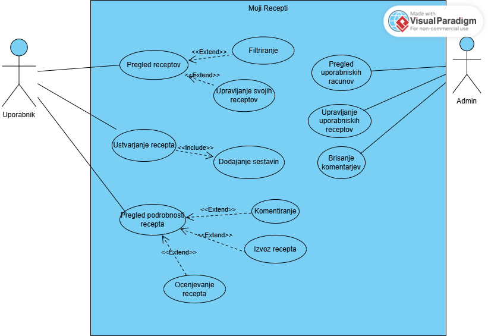
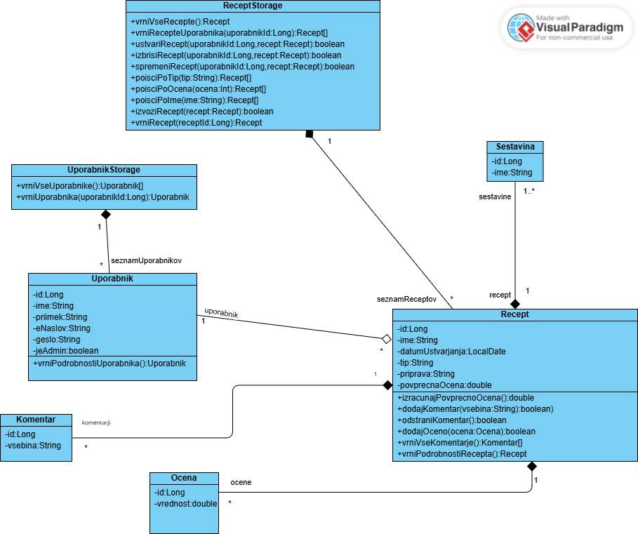

# Projekt: Aplikacija za recepte (RIS)
## Poslovni Problem in Rešitev
### Problem
Domači kuharji imajo svoje recepte pogosto shranjene na fizičnih listkih, v različnih zvezkih ali kot neorganizirane digitalne zaznamke. Ta razpršenost vodi v podvajanje in izgubo receptov ter zmanjšuje veselje do kuhanja.
### Rešitev
Vzpostavili smo osebni sistem za upravljanje kulinaričnih receptov, ki uporabnikom omogoča digitalno shranjevanje, kategorizacijo in hitro iskanje lastne zbirke receptov. Poleg upravljanja zasebne zbirke sistem omogoča tudi **brskanje, ocenjevanje in komentiranje** javno dostopnih receptov ostalih uporabnikov.

## Ključne Funkcionalnosti

* **Upravljanje z recepti:**
    * Kreiranje novega recepta z vnosom naziva, opisa, postopka priprave in časa kuhanja.
    * Pregledovanje seznama vseh lastnih receptov.
    * Prikaz podrobnosti posameznega recepta.
    * Urejanje in brisanje obstoječih receptov.	
* **Upravljanje s sestavinami:**
    * Dinamično dodajanje, urejanje in brisanje sestavin.
* **Socialne Funkcionalnosti:**
    * Brskanje po javni zbirki *vseh* receptov.
    * Ocenjevanje receptov.
    * Komentiranje receptov.
* **Upravljanje Uporabnikov:**
    * Admin ima dostop do seznama vseh registriranih uporabnikov.
    * Admin ima možnost brisanja kateregakoli uporabnika.
* **Upravljanje Receptov:**
    * Admin ima možnost brisanja *kateregakoli* recepta.
* **Upravljanje Komentarjev:**
    * Admin ima možnost brisanja *kateregakoli* komentarja kateregakoli uporabnika.

## Meje Rešitve (Obseg)

### Kaj je vključeno:
* Sistem je namenjen osebni, zasebni zbirki receptov.
* Uporabnik vidi in upravlja izključno svoje vnose.
* Vnos podatkov je ročen.
* Sistem omogoča javno brskanje, komentiranje in ocenjevanje drugih receptov.
* Sistem vključuje ločen administratorski vmesnik (ali administratorske funkcije znotraj obstoječega vmesnika) za upravljanje vsebin in uporabnikov.

### Česa ni vključeno:
* Naročanje hrane.
* Naprednih funkcij (npr. AI chatbot).
* Medsebojnega sledenja uporabnikov ali naprednega socialnega omrežja.
* Možnosti urejanja tujih receptov ali komentarjev (razen s strani Admina).


## Slovar pojmov

| Izraz               | Definicija |
|---------------------|-----------|
| **Moji recepti**    | Informacijska rešitev – naziv spletne aplikacije. |
| **Recept**          | Strukturiran zapis postopka priprave jedi, ki vsebuje ime jedi, tip jedi, opis priprave ter seznam potrebnih sestavin. Recept je ustvarjen in lastniško povezan z enim uporabnikom ter ima shranjen datum nastanka in oceno. |
| **Sestavina**       | Sestavni del recepta – posamezna surovina ali izdelek (npr. moka, jajce, mleko), ki se uporablja pri pripravi jedi. Vsaka sestavina pripada točno enemu receptu. |
| **Priprava**        | Posamezni koraki oziroma postopek za izvedbo jedi. |
| **Tip**             | Kategorija, v katero recept spada. Uporabnik izbira med že določenimi kategorijami, npr. *sladice*, *kosilo*, *na hitro*. |
| **Ocena**           | Povprečna ocena recepta, izračunana iz posamičnih ocen uporabnikov. |
| **Datum ustvarjanja** | Datum (format: leto–mesec–dan), ko uporabnik ustvari recept. |
| **Komentar**        | Zapis, ki ga uporabnik doda k receptu kot povratno informacijo, mnenje ali vprašanje. Komentar je vedno povezan z enim receptom in enim uporabnikom ter vsebuje vsebino komentarja, datum/čas objave in podatke o avtorju (uporabniku). |
| **Uporabnik**       | Oseba, ki ima v sistemu ustvarjen uporabniški račun in se vanj prijavlja z e-poštnim naslovom in geslom. Uporabnik lahko pregleduje recepte, ustvarja nove recepte, upravlja svoje recepte (jih ureja in briše) ter recepte komentira. Vsak recept ima natanko enega lastnika – uporabnika, uporabnik pa ima lahko nič, enega ali več receptov. |
| **Administrator**   | Pooblaščena oseba z razširjenimi pravicami v sistemu. Administrator ima pregled nad uporabniškimi računi ter upravlja uporabniške recepte (jih lahko ureja in briše) in uporabniške komentarje (npr. briše neprimerne komentarje). |

## Diagram primerov uporabe


## Razredni diagram

- Uporabnik: vsebuje podatke o uporabniku. Ima tudi metodo ki vrne podrobnosti določenega uporabnika.
- UporabnikStorage je razred za delo s Uporabniki. Vsebuje seznam vseh uporabnikov in metode vrni vse uporabnike ter vrni uporabnika.
- Recept je razred s podatki za recept. Omogoča izračun poprečne ocene recepta, dodajanje in odstranjevanje komentarjev, dodajanje ocene, vrača komentarje in vse podrobnosti recepta. Ima atribut Uporabnik, seznam ocen recepta in seznam komentarjev recepta.
- Sestavina: shrani podatke o sestavine
- Komentar: hrani podatke o komentarju
- Ocena: hrani podatke o oceni
- ReceptStorage: hrani podatke - vse recepte in ima metode za delo z njimi kot so vrni vse recepte, vrni recepte uporabnika, ustvari recept, izbrisi recept, spremeni recept, iskanje po parametrih, vračanje recepta in metodo za izvoz recepta.

## Unit testi in poročilo o testiranju

V repozitoriju je bila dodana nova mapa `testiranje`, ki vsebuje unit teste za aplikacijo in poročilo o testiranju (`porocilo_testiranja.md`). 

- Testi zajemajo funkcionalnosti ustvarjanja in brisanja receptov.
- V poročilu so opisani testi, kaj preverjajo, kdo je odgovoren za katere teste in analiza uspešnosti testov.

## Dokumentacija za razvijalce


Obstajata dva dela:

**1) /backend**
- `src/main/java/um/si/feri/ris/vaje/app_za_recepti`: Glavna izvorna koda Java.
  - `controllers`: Vsebuje Spring REST krmilnike (npr. `ReceptController`, `UporabnikController`), ki definirajo API končne točke.
  - `models`: Vsebuje JPA entitete (npr. `Recept`, `Sestavina`), ki predstavljajo tabele v bazi podatkov.
  - `dao`: Vsebuje Spring Data JPA repozitorije (npr. `ReceptRepository`) za dostop do podatkov.
- `pom.xml`: Maven datoteka, ki upravlja z odvisnostmi in gradnjo projekta.
- `src/main/resources/application.properties`: Konfiguracijska datoteka za Spring Boot (vključno s povezavo do baze podatkov).

**2) /my-app**: Vsebuje sprednjo (client-side) kodo.
- `public`: Vsebuje statične datoteke in index.html.
- `src`: Glavna izvorna koda za React.
  - `pages`: Vsebuje komponente, ki predstavljajo posamezne strani (npr. `Domov.js`, `VsiRecepti.js`).
  - `services/api.js`: Vsebuje logiko za komunikacijo z zalednim API-jem (z uporabo knjižnice `axios`).
  - `App.js`: Glavna komponenta aplikacije, ki skrbi za usmerjanje (routing).
- `package.json`: Datoteka, ki upravlja z odvisnostmi (npm) in skriptami za sprednji del.


## Uporabljena orodja, frameworki in različice:

**1)Backend**  
-Java 23 (Jezik)  
-Spring Boot 3.5.6 (REST API)  
-Spring Data JPA 3.5.6 (Dostop do podatkovne baze)  
-Maven 3.9.11 (Upravljanje odvisnosti in gradnja jave)  
-MySQL latest (Docker podatkovna baza)  
 
**2)Frontend**  
-React 19.2.0 (UI)  
-React Router 7.9.4 (Navigacija)  
-Axios 1.12.2 (backend komunikacija skozi HTTP)  
-Node.js (Okolje in packet manager za JavaScript)  

**3)Docker (zagon MySQL baze)**


## Standardi kodiranja:

**Java in Spring Boot** - Razredi PascalCase, metode in spremenljivke camelCase.

**React in JavaScript** - Komponente PascalCase, ostali JS camelCase.

Osnovni paket aplikacije je **um.si.feri.ris.vaje.app_za_recepti.** Znotraj tega paketa se nahaja:  
**AppZReceptiApplication.java**: To je glavna vstopna točka (entry point) aplikacije. Ta datoteka vsebuje main metodo, ki zažene celotno Spring Boot aplikacijo.  

Struktura je nato razdeljena na naslednje ključne podpakete:  

**/models**: Ta paket vsebuje podatkovne modele (entitete). To so Java razredi (POJO), ki z anotacijami @Entity predstavljajo strukturo tabel v podatkovni bazi. Po naši konvenciji se imenujejo Ime.java (npr. Recept.java, Uporabnik.java in Sestavina.java).  

**/dao (Data Access Object)**: Tukaj so definirani vmesniki (Repositories) za dostop do podatkov. Ti vmesniki, ki sledijo naši konvenciji ImeVmesnikaRepository.java (npr. ReceptRepository.java), razširjajo Spring Data JPA vmesnike (kot je CrudRepository) in s tem avtomatizirajo izvajanje SQL poizvedb.  

**/controllers**: Ta paket vsebuje krmilnike (Controllers), ki definirajo REST API vmesnik naše aplikacije. Vsak krmilnik, poimenovan po vzorcu ImeController.java (npr. ReceptController.java), z anotacijami, kot je @RestController, sprejema HTTP zahteve, komunicira s poslovno logiko (ali neposredno z repozitoriji) in vrača odgovore odjemalcu (npr. v formatu JSON).  


## Tehnologije in verzije

Potrebujete Docker, Npm (node.js), Java JDK 23 (ali visje) in Apache Maven.

**Koraki:**

**1)Zagon podatkovne baze (Docker)**
V terminalu zaženite naslednji ukaz, da ustvarite in zaženete Docker vsebnik z MySQL bazo:

```bash
docker run -d --name ris-mysql-db -p 3369:3306 -e MYSQL_ROOT_PASSWORD=root -e MYSQL_DATABASE=ris mysql:latest
```

**2)Namestitev odvisnosti za sprednji del (Frontend)**
Pomaknite se v mapo my-app in namestite potrebne npm pakete:

```bash
npm install
```

**3)Zagon zalednega dela (Backend)**
Odprite nov terminal. Pomaknite se v mapo backend in zaženite Spring Boot aplikacijo z Mavenom:

```bash
./mvnw.cmd spring-boot:run
```

**4)Zagon sprednjega dela (Frontend)**
V terminalu, kjer ste v mapi my-app (iz koraka 2), zaženite React razvojni strežnik:

```bash
npm start
```

## Za razvijalce

Če želite prispevati k projektu:  

**1)Naredite Fork projekta.**

**2)Ustvarite novo vejo (Branch)**, kjer boste delali na projektu:

```bash
git checkout -b ime-vase-funkcionalnosti
```

**3)Svoje spremembe commit-ajte in dodajte (add), in potem potisnite (push) na svojo vejo**:

```bash
git add spremenjene-datoteke (ali . za vse)
git commit -m "jasno sporočilo o spremembi"
git push origin ime-vase-funkcionalnosti
```

**4)Naredite Pull Request na GitHub-u z opisom in razlago sprememb vaše veje (`ime-vase-nove-funkcionalnosti`) v glavno vejo originalnega projekta (main), potem pa čakajte na odgovor.**

## Implementacija funkcionalnosti

**1) Izvoz pdf**

 Iz trenutnega pregleda recepta, je omogočen izvoz vse pomembne informacije, kot so ime recepta, tip, opis priprave, seznam sestavin in ocena. Funkcionalnost je zasnovana tako, da uporabniku omogoča trajno shranjevanje recepta zunaj aplikacije.
 
 **Kako deluje?**
 
Na strani za prikaz podrobnosti recepta je dodan namenski gumb, ki je implementiran kot ločena komponenta IzvozButton. Ob kliku na ta gumb se samodejno generira pdf z imenom recepta z vsemi podatki. 

**Preizkus funkcionalnosti**

Uporabnik lahko funkcionalnost preizkusi tako, da v aplikaciji izbere recept in s tem se premakne na stran s podrobnosti izbranega recepta. Na te strani je prikazan gumb Izvozi Recept. Ko uporabnik klikne na ta gumb, se podrobnosti recepta takoj izvozijo v trajno obliko (pdf) in shrani na napravi.


**2) Komentiranje**

 Prijavljen uporabnik je sposoben komentirati na posamezni strani prikazanega recepta in tako izraziti svoje mnenje, postaviti vprašanje in podobno. 
 
**Kako deluje?**

Na strani za prikaz podrobnosti recepta je dodan obrazec za vnos komentarja in div za prikaz obstoječih komentarjev. Implementiran je kot ločena komponenta Komentarji. Ob kliku na gumb Objavi ki se nahaja pod obrazcem se uporabnikov komentar shrani v seznam komentarjev določenega recepta in se prikaže v območju za prikaz komentarjev. Komentar prikazuje ime uporabnika in njegov komentar.

**Preizkus funkcionalnosti?**

Uporabnik lahko komentiranje preizkusi tako, da v aplikaciji izbere določen recept oziroma sproži akcijo prikaza podrobnosti recepta, kjer je na dnu strani prikazana forma in že obstoječi komentarji. Če bo poskušal komentirati brez predhodne prijave bo dobil obvestilo o obvezni predhodni prijavi. Ko prijavljen uporabnik nato izpolni obrazec in klikne na objavo se bo njegov komentar takoj prikazal v seznamu obstoječih komentarjev.


**3) Ocenjevanje**  

Prijavljenim uporabnikom je omogočeno ocenjevanje receptov drugih avtorjev z uporabo lestvice zvezdic (od 1 do 5). Ta funkcionalnost omogoča vrednotenje kulinaričnih vsebin in samodejni izračun povprečne ocene, kar služi kot kazalnik priljubljenosti in kakovosti recepta.

**Kako deluje?**  

Na strani za prikaz podrobnosti recepta je dodan interaktivni sklop z zvezdicami in gumbom za oddajo ocene. Ob nalaganju strani sistem preveri status uporabnika in morebitno že obstoječo oceno. Ob kliku na gumb "Oddaj oceno" se podatki pošljejo na strežnik, kjer se ocena shrani, sistem pa samodejno preračuna novo povprečje recepta. Vmesnik preprečuje, da bi avtor ocenjeval lastne recepte.

**Preizkus funkcionalnosti?**  
 
Uporabnik lahko ocenjevanje preizkusi tako, da odpre stran s podrobnostmi kateregakoli recepta, ki ga ni ustvaril sam. V sekciji za ocenjevanje izbere želeno število zvezdic in klikne gumb za oddajo. Če uporabnik ni prijavljen, ga sistem opozori na obvezno prijavo. Po uspešni oddaji se prikaže potrditveno sporočilo ("Hvala za vašo oceno!"), povprečna ocena recepta na vrhu strani pa se takoj posodobi na novo vrednost.


